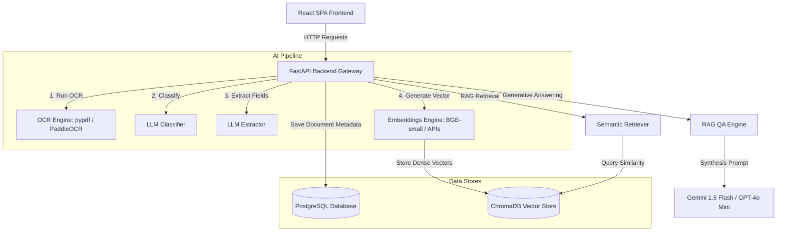
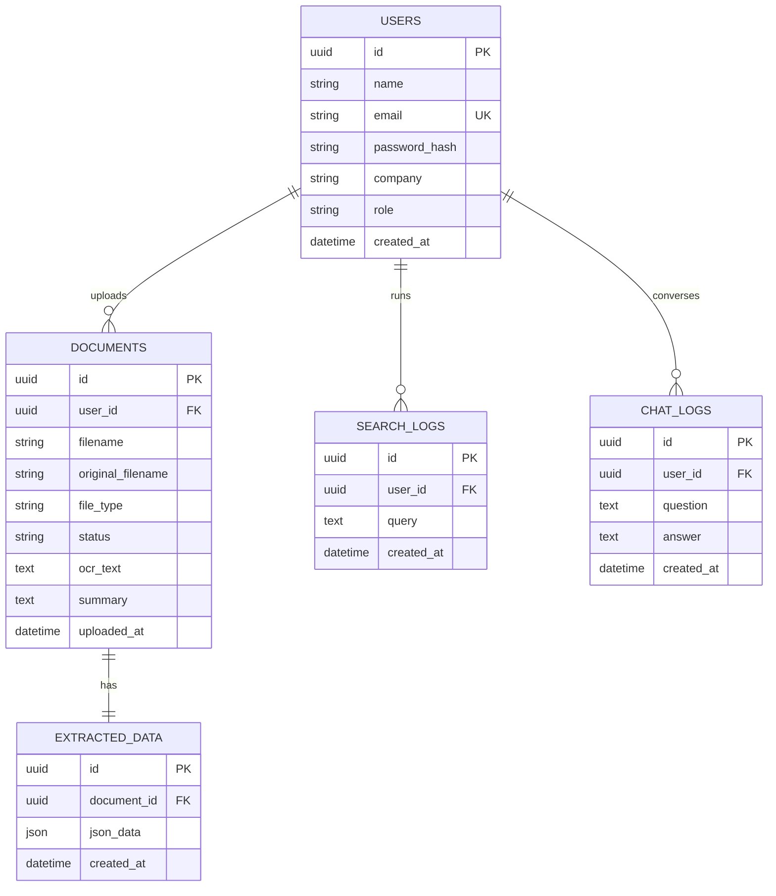

# DocMind AI - Intelligent Document Processing & RAG Cabinet

DocMind AI is a production-ready, high-performance intelligent document processing (IDP) and retrieval-augmented generation (RAG) cabinet. It automates text extraction, document classification, structured metadata harvesting, semantic vector searches, and cited QA conversations over your files.

---

## 🚀 Key Features

* **Multi-Format Upload Pipeline**: Securely upload PDF, PNG, JPG, and JPEG files up to 20MB. Includes animated pipeline steps visualizer.
* **Intelligent Document OCR**: Extracts full-text from images and PDFs using a hybrid `pypdf` digital text parser and PaddleOCR engine.
* **AI Classification**: Automatically categorizes files into *Invoice*, *Receipt*, *Resume*, *Bank Statement*, *Contract*, or *Other* using Gemini / OpenAI LLM APIs.
* **Structured Key-Value Harvesting**: Extracts critical information (e.g. total amounts, date, contract parties, or candidate resume skills) mapped to individual field-level confidence percentages.
* **Persistent Vector Store (ChromaDB)**: Embeds document text using BGE-small dense models locally and indexes them under strict multi-tenant user security filters.
* **Semantic Natural Language Search**: Query files conceptually (e.g., *"Show Amazon invoices over ₹50,000"*) matching highlights and scores.
* **Retrieval-Augmented Chat (RAG)**: Chat with your document vault. Responses synthesize context from matching resources and dynamically append clickable citation cards leading to original documents.
* **Data Exports**: Download raw OCR text (`.txt`), structured extraction payloads (`.json`), or search grids (`.csv`).

---

## 🛠️ Architecture & System Design

The application utilizes a decoupling model separating the API controller layers from core OCR engines, vector indexing, and generative answering pipelines.



---

## 🗄️ Database Entity Schema

The PostgreSQL database maintains document registries, extracted properties, and user session log tracking.



---

## 🔌 API Endpoint Summary

All API endpoints are hosted under the `/api` prefix and require JWT token authentication (except auth gateways).

| Category | Method | Path | Description |
| :--- | :--- | :--- | :--- |
| **Authentication** | `POST` | `/api/auth/register` | Registers a new account. |
| | `POST` | `/api/auth/login` | Logs in and yields access/refresh tokens. |
| **Documents** | `POST` | `/api/documents` | Uploads a raw document. |
| | `GET` | `/api/documents` | Lists all user documents (paginated & filtered). |
| | `GET` | `/api/documents/stats` | Computes dashboard analytics and chart metrics. |
| | `GET` | `/api/documents/{id}` | Fetches metadata, summary, and fields. |
| | `POST` | `/api/documents/{id}/process` | Runs OCR, classification, extraction, and embedding. |
| | `GET` | `/api/documents/{id}/ocr` | Returns raw OCR text snippet. |
| | `DELETE` | `/api/documents/{id}` | Deletes document and its vector indices. |
| **Semantic Search**| `POST`/`GET`| `/api/search` | Search files semantically. |
| **RAG Answering** | `POST` | `/api/chat` | Answer questions citing source documents. |
| **Health** | `GET` | `/health` | Live service health check status. |

---

## ⚙️ Installation & Docker Setup

To spin up the entire application locally, you only need Docker Compose.

### 1. Configure Credentials
Create a `.env` file in the `server` directory (or export variables in your environment):
```bash
GEMINI_API_KEY="your-gemini-api-key-here"
# OR
# OPENAI_API_KEY="your-openai-api-key-here"
```
> [!NOTE]
> If no API keys are provided, the server initializes and boots up safely using local heuristics for classification, metadata extraction, and QA synthesis.

### 2. Startup Docker Containers
```bash
cd server
docker compose up --build
```
This builds and launches:
1. **PostgreSQL Container (`db`)**: Exposing port `5432`.
2. **FastAPI Web Container (`web`)**: Running migrations, auto-seeding sample demo files if empty, and exposing port `8000`.

### 3. Startup Frontend
Install dependencies and boot up the Vite server:
```bash
npm install
npm run dev
```
Open [http://localhost:5173](http://localhost:5173) in your browser. Log in using the seeded profile:
* **Username**: `demo@example.com`
* **Password**: `password123`

---

## 📂 Project Structure

```
DocMind_AI/
│
├── server/
│   ├── app/
│   │   ├── ai/               # OCR, Embeddings, Classifier, Extractor, RAG
│   │   ├── api/              # FastAPI Routers (Auth, Documents, Search, Chat)
│   │   ├── auth/             # JWT dependency verification and password utilities
│   │   ├── database/         # Session local postgres pool engine bind
│   │   ├── models/           # Declarative mapping models
│   │   ├── schemas/          # Pydantic validation serializers
│   │   └── main.py           # Application entrypoint registration
│   │
│   ├── migrations/           # Alembic database schemas versionings
│   ├── uploads/              # Local disk document files storage
│   ├── Dockerfile
│   ├── entrypoint.sh         # Startup check, migration, auto-seeding scripts
│   ├── seed.py               # 21 multi-type document database populator
│   └── requirements.txt      # PyPI packages index
│
├── src/                      # React Frontend Source
│   ├── app/
│   │   ├── api/              # Axios http call definitions and React Query hooks
│   │   ├── components/       # Layouts and generic Shadcn UI wrappers
│   │   └── pages/            # View components (Dashboard, Documents, Search, Chat)
│   └── main.tsx
│
└── README.md
```