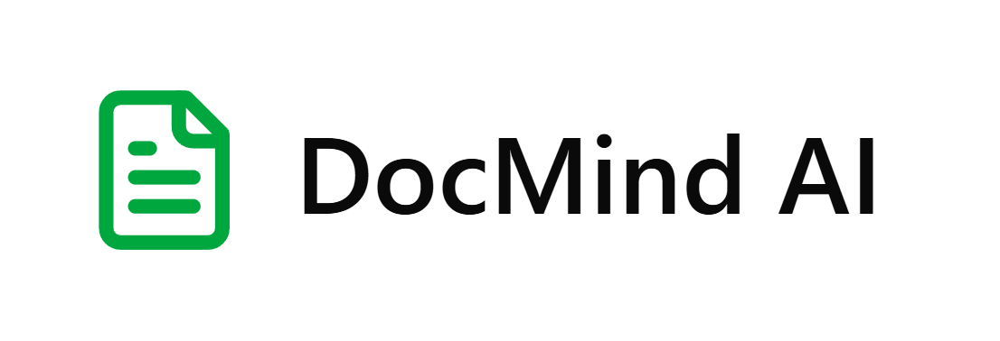

<p align="center">
  
</p>

<h1 align="center">🧠 DocMind AI</h1>

<p align="center">
  <strong>AI-Powered Document Intelligence Platform</strong>
</p>

<p align="center">
Upload • Extract • Search • Chat • Analyze
</p>

<p align="center">


</p>

<p align="center">

🌐 **Live Demo:** https://doc-mind-ai-ashy.vercel.app

📚 **API Docs:** https://docmind-ai-268e.onrender.com/docs

⭐ If you found this project useful, consider giving it a star.

</p>

---

# 📖 Overview

DocMind AI is a production-ready AI-powered Document Intelligence Platform built with **FastAPI**, **React**, **PostgreSQL**, and **ChromaDB**.

The application enables users to upload PDFs and images, extract structured information using OCR and AI, perform semantic search through vector embeddings, and interact with documents using Retrieval-Augmented Generation (RAG).

It demonstrates a complete AI document processing pipeline from ingestion to conversational document intelligence.

---

# ✨ Key Features

## 📄 Intelligent Document Processing

- PDF, PNG and JPG uploads
- OCR-based text extraction
- AI document classification
- Structured field extraction
- Automatic document summarization
- Confidence score generation

---

## 🔍 Semantic Search

- Vector embeddings
- ChromaDB Vector Database
- Similarity search
- Keyword search
- Highlighted search results
- AI-powered summaries

---

## 💬 AI Chat

- Retrieval-Augmented Generation (RAG)
- Context-aware conversations
- Multi-document retrieval
- Source citations
- Conversation history

---

## 📊 Analytics Dashboard

- Document statistics
- Upload trends
- Processing success metrics
- Confidence score analytics
- Search analytics
- Chat analytics

---

## 🔐 Authentication

- JWT Authentication
- Secure Login
- User Registration
- Protected Routes
- Role-based API Security

---

# ⭐ Project Highlights

- Production-ready Full Stack AI Application
- OCR Document Understanding
- AI-powered Information Extraction
- Semantic Search using Vector Embeddings
- Retrieval-Augmented Generation (RAG)
- FastAPI REST APIs
- PostgreSQL + Alembic
- ChromaDB Integration
- Cloud Deployment on Render & Vercel

---

# 🏗 System Architecture

```text
                   React + Vite
                      (Vercel)
                          │
                          │ REST API
                          ▼
               FastAPI Backend (Render)
                          │
     ┌────────────────────┼────────────────────┐
     │                    │                    │
     ▼                    ▼                    ▼
 Neon PostgreSQL      ChromaDB           Gemini/OpenAI
     │             Vector Database          AI Models
     │
     ▼
Document Metadata
```

---

# 🤖 AI Processing Pipeline

```text
Document Upload
        │
        ▼
OCR Extraction
        │
        ▼
Document Classification
        │
        ▼
Field Extraction
        │
        ▼
Summary Generation
        │
        ▼
Embedding Generation
        │
        ▼
ChromaDB Storage
        │
        ▼
Semantic Search
        │
        ▼
AI Chat (RAG)
```

---

# 🛠 Technology Stack

## Frontend

- React 19
- TypeScript
- Vite
- Tailwind CSS
- React Query
- React Hook Form
- Recharts
- Zod

---

## Backend

- FastAPI
- SQLAlchemy
- Alembic
- PostgreSQL
- AsyncPG
- JWT Authentication

---

## AI & Machine Learning

- PaddleOCR
- Google Gemini
- OpenAI
- Sentence Transformers
- ChromaDB
- Vector Embeddings
- Semantic Search
- Retrieval-Augmented Generation (RAG)

---

# 📸 Screenshots

| Dashboard | Upload |
|-----------|--------|
| *(Add Screenshot)* | *(Add Screenshot)* |

| Search | AI Chat |
|---------|---------|
| *(Add Screenshot)* | *(Add Screenshot)* |

| Analytics | Document Details |
|------------|-----------------|
| *(Add Screenshot)* | *(Add Screenshot)* |

---

# 🚀 Getting Started

## Clone Repository

```bash
git clone https://github.com/prvsh77/DocMind-AI.git
cd DocMind-AI
```

---

## Frontend

```bash
npm install
npm run dev
```

---

## Backend

```bash
cd server

python -m venv .venv

source .venv/bin/activate
# Windows
.venv\Scripts\activate

pip install -r requirements.txt

python -m alembic upgrade head

python seed.py

python -m uvicorn app.main:app --reload
```

---

# ⚙ Environment Variables

## Frontend

```env
VITE_API_BASE_URL=
VITE_API_TIMEOUT_MS=
```

---

## Backend

```env
DATABASE_URL=
JWT_SECRET_KEY=
JWT_ALGORITHM=
OPENAI_API_KEY=
GEMINI_API_KEY=
UPLOAD_DIR=
```

---

# 📂 Project Structure

```text
DocMind-AI
│
├── server
│   ├── app
│   │   ├── ai
│   │   ├── api
│   │   ├── auth
│   │   ├── database
│   │   ├── models
│   │   └── schemas
│   └── migrations
│
├── src
│   ├── app
│   ├── components
│   ├── pages
│   └── api
│
├── assets
├── README.md
└── package.json
```

---

# ☁ Deployment

| Service | Platform |
|----------|----------|
| Frontend | Vercel |
| Backend | Render |
| Database | Neon PostgreSQL |
| Vector Store | ChromaDB |

---

# 🎯 Future Enhancements

- Multi-document Chat
- Real-time AI Streaming
- Team Workspaces
- Document Versioning
- Docker Deployment
- Kubernetes Support
- Agentic AI Workflows
- Enterprise Authentication

---

# 🤝 Contributing

Contributions are welcome.

Feel free to fork the repository, open issues, and submit pull requests.

---

# 📄 License

Licensed under the MIT License.

---

# 👨‍💻 Developer

**M Prashant Rao**

AI Engineer • Machine Learning • Generative AI • Python • FastAPI • React

---

<p align="center">

⭐ If you enjoyed this project, don't forget to leave a star.

Made with ❤️ using FastAPI, React, PostgreSQL, ChromaDB, and Generative AI.

</p>
